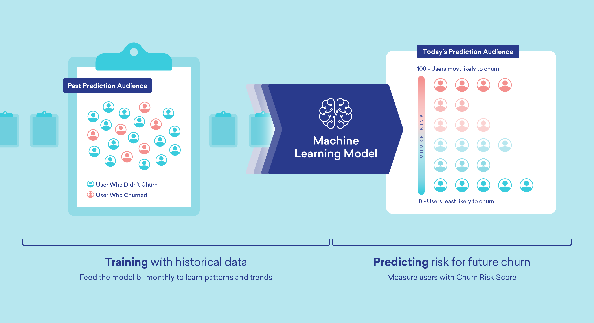

# Customer churn prediction
**Author**: Dang Yen Linh

**Email**: dangyenlinhh@gmail.com

**Linkedln**: https://www.linkedin.com/in/dangyenlinhh/

Churn rate is a marketing metric that describes the number of customers who leave a business over a specific time period. Every user is assigned a prediction value that estimates their state of churn at any given time. This value is based on:

* User demographic information
* Browsing behavior
* Historical purchase data among other information
It factors in our unique and proprietary predictions of how long a user will remain a customer. This score is updated every day for all users who have a minimum of one conversion. The values assigned are between 1 and 5.

Recognizing the significance of customer churn, as it's far more cost-effective to retain existing customers than to acquire new ones, this project aims to develop a robust predictive model. This model will effectively pinpoint customers at high risk of churn based on their historical interactions and distinctive characteristics, helping companies proactively address churn and foster long-term customer relationships.

### Overview
Throughout this project, I undertook the following steps:
1. Analyze and Preprocess data - Check if the dataset has missing values or has any other problem.
2. Feature Engineering
3. Build Model

    Try DecisionTree, RandomForest, XGBoost, CatBoost

4. Perform model on the training set and test set using gridSearch CV
5. Measure the performance of the model.
6. Try a model with handle label imbalances.
